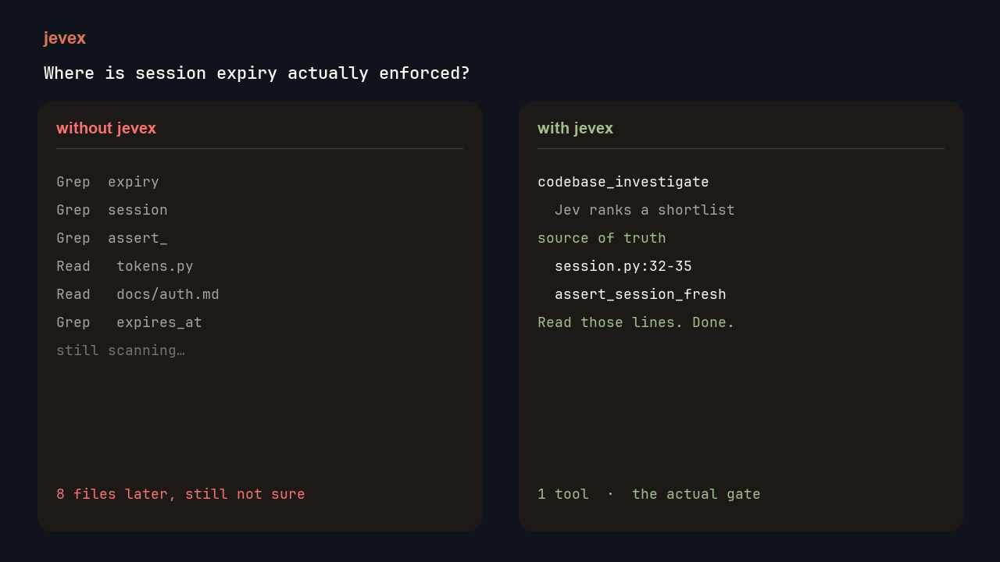

# jevex

Coding agents waste most of their time **finding** code, not writing it. **jevex is the find workflow.**

Ask *where is this actually enforced?* The agent calls one MCP tool. Jev scores a shortlist. The agent reads those lines instead of grepping the tree.

| | without jevex | with jevex |
| --- | ---: | ---: |
| Mean time (16 SWE-bench questions) | 160s | **69s** |
| Agent bill | $8.74 | **$3.13** |
| Hit the file to patch | 16 / 16 | **16 / 16** |
| Files Claude Code opened (fixture) | 6.8 | **2.2** |
| Jev | — | **~$0.0015 / question** |

Same agent, with vs without. Same source of truth, less grep. Give it only 90 seconds and it is 1/16 vs 11/16 finished.



## What it is

A layer under Claude Code / Cursor / any MCP agent. Not a second agent. Not a `jev_evaluate` wrapper.

You still plan and patch. jevex only answers **what to read**.

## How it works

1. **Index** whatever a coding agent can already read (py, ts, go, rs, md, …).
2. **Ask** `codebase_investigate` with the engineering question.
3. **Jev** ranks a shortlist (source of truth, tests, callers). The agent `Read`s those ranges.

```
you → coding agent → codebase_investigate → Jev on a shortlist → files + lines → agent reads
```

## Integration

```bash
git clone https://github.com/jimmyhealer/jev-semantic-explorer
cd jev-semantic-explorer
pip install -e ".[mcp]"
```

**Claude Code**

```bash
claude mcp add jevex \
  -e JEV_API_KEY=ts_... \
  -e JEV_EXPLORER_REPO=/absolute/path/to/your/repo \
  -- jev-explorer-mcp
```

**Cursor** — add this to `.cursor/mcp.json`:

```json
{
  "mcpServers": {
    "jevex": {
      "command": "jev-explorer-mcp",
      "env": {
        "JEV_API_KEY": "ts_...",
        "JEV_EXPLORER_REPO": "/absolute/path/to/your/repo"
      }
    }
  }
}
```

Ask the agent: *where is session expiry enforced?* It should call `codebase_investigate` first.

## CLI

```bash
cd /path/to/your/repo
jevex investigate "Where is session expiry actually enforced?"
```

`--json` prints the full packet. `jevex index .` writes a reusable `.jev-index.json`.

## Limits

Read-only. Not a patcher. Jev never sees the whole repo — only the shortlist.

MIT. [CONTRIBUTING.md](CONTRIBUTING.md) · [SECURITY.md](SECURITY.md)
